[TOC]

# Timer

`Timer`：设置计划的任务，任务以**队列依次**执行。

`TimerTask`：任务

## 定时任务

`schedule(TimerTask task, Date time)`：在指定日期执行一次任务。如果执行时间早于当前时间，则立即执行任务。

```mermaid
gantt
    dateFormat  HH:mm:ss
    title 定时任务
    section 时间轴
    当前时间 :crit, d2, 12:00:00,12:00:01
    section 晚于当前
    Task A :pA1, 12:00:20, 3m
    section 执行A
    Done A:done, dA1, 12:00:20, 3m
    
    section 早于当前
    Task B :pB1, 11:58:00,3m
    section 执行B
    Done B :done, dA1, 12:00:00, 3m
    
    section 多任务
    Task C1 :pC1, 12:00:20, 2m
    Task C2 :pC2, after pC1, 2m
    Task C2 :pC3, after pC2, 2m
    section 执行C
    Done C1 :done, dC1, 12:00:20, 3m
    Done C2 :done, dC2, after dC1, 2m
    Done C2 :done, dC3, after dC2, 1m
```

## 延时任务

`schedule(TimerTask task, long period)`：以当前时间为参考，在此基础上延时指定时间后执行一次任务。

```mermaid
gantt
    dateFormat  HH:mm:ss
    title 延时任务
    section 时间轴
    当前时间 :crit, d2, 12:00:00,12:00:01
    section 延时5s
    Task A :pA1, 12:00:05, 1m
    section 执行
    Done A:done, dA1, 12:00:05, 1m
```

## 定时周期任务

`schedule(TimerTask task, Date time, long period)`：指定的日期之后，按指定间隔周期地**无限循环**执行任务。如果执行时间早于当前时间，则立即执行任务。

```mermaid
gantt
    dateFormat  HH:mm:ss
    title 定时周期任务
    section 时间轴
    当前时间 :crit, d2, 12:00:00,12:00:02
    section 计划(A)
    Task A1 :pA1, 12:00:20,3m
    Task A2 :pA2, after pA1,3m
    Task A3 :pA3, after pA2,3m
    section 执行(A)
    Task A1 :done, dA1, 12:00:20,4m
    Task A2 :done, dA2, after dA1,3m
    Task A3 :done, dA3, after dA2,3m
    
    section 计划(B)
    Task B1 :pB1, 11:56:20, 3m
    Task B2 :pB2, after pB1, 3m
    Task B3 :pB3, after pB2, 3m
    section 执行(B)
    Task B3 :done, dB3, 12:00:00, 4m
    Task B4 :done, dB4, after dB3, 3m
    Task B5 :done, dB5, after dB4, 4m
```

`scheduleAtFixedRate(TimerTask task, Date time, long period)`：指定的日期之后，按指定间隔周期地**无限循环**执行任务。

```mermaid
gantt
    dateFormat  HH:mm:ss
    title 周期任务
    section 时间轴
    当前时间 :crit, d2, 12:00:00,12:00:01
    section 计划
    Task A1 :pA1, 12:00:20,3m
    Task A2 :pA2, after pA1,3m
    Task A3 :pA3, after pA2,3m
    section 不延时执行
    Done A1 :done, dA1, 12:00:20,2m
    Done A2 :done, dA2, after dA1,3m
    Done A3 :done, dA3, after dA2,2m
    
    section 延时执行
    Done B1 :done, dB1, 12:00:20, 4m
    Done B2 :done, dB2, after dB1,3m
    Done B3 :done, dB3, after dB2,2m
    
    section 追赶型
    Task C1 :pC1, 11:56:00, 3m
    Task C2 :pC2, after pC1, 3m
    Task C3 :pC3, after pC2, 3m
    section 执行(C)
    Done C1 :done, dC1, 12:00:00, 3m
    Done C2 :done, dC2, 12:00:00, 3m
    Done C3 :done, dC3, 12:02:00, 3m
```

## 延时周期任务

`schedule(TimerTask task, long delay, long period)`：以当前时间为参考，在此基础上延时指定时间后执行周期性任务。

```mermaid
gantt
    dateFormat  HH:mm:ss
    title 延时周期任务
    section 时间轴
    当前时间 :crit, d2, 12:00:00,12:00:01
    section 计划
    Task A1 :pA1, 12:00:20,3m
    Task A2 :pA2, after pA1,3m
    Task A3 :pA3, after pA2,3m
    section 不延时执行
    Task A1 :done, dA1, 12:00:20,2m
    Task A2 :done, dA2, 12:03:20,2m
    Task A3 :done, dA3, 12:06:20,2m
    
    section 延时执行
    Task B1 :done, dB1, 12:00:20, 4m
    Task B2 :done, dB2, after dB1,3m
    Task B3 :done, dB3, after dB2,2m
```

## 清除任务
`Timer.cancel()`：将任务队列中的全部任务清空。

`TimerTask.cancel()`：将自身从任务队列中清除。