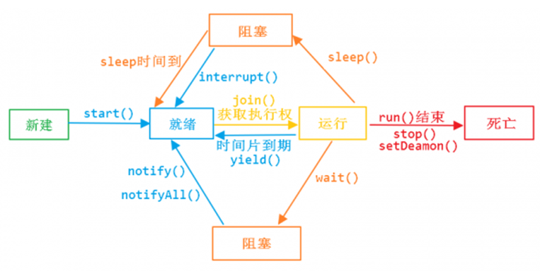

[TOC]

# 1.基本概念

## 1.1 线程与进程

### 1.1.1 进程

一个具有一定**独立功能的程序**在一个**数据集**上的一次**动态执行的过程**。一般由程序，数据集合和进程控制块三部分组成：

-   程序：控制进程执行的指令集。

-   数据集：执行需要的数据和工作区。

-   程序控制块：包含进程的描述信息和控制信息，是进程存在的唯一标志。

特征：

-   动态性：临时的，动态产生与消失
-   并发性：多个进程同时执行
-   独立性：进程之间互不干扰
-   结构性：由程序，数据集，程序控制块组成

**资源分配的最小单位**，进程内部有多个线程，线程之间会共享资源。

### 1.1.2 线程

**CPU调度的最小单位**，必须依赖进程而存在。

线程是**协作式**，不是抢占式。


### 问题：线程与进程的关系?

>   线程是轻量级进程，基本的调度单位。

### 问题：线程的优势和存在的风险

>   -   线程安全问题。`竞态条件(Reace Condition)`
>
>   -   活跃性问题。当某个操作无法继续执行下去，就会发生活跃性问题。例如死循环。
>
>   -   性能问题。存在`线程调度器(RR调度)`频发触发`上下文切换(Context Switch)`

### 1.1.3 协程


## 1.2 并行与并发

### 1.2.1 并行

同一时刻可以同时处理事情的能力。

### 1.2.2 并发

在单位时间内可以处理事情的能力。

### 问题：为什么需要并发？

>   -   资源利用率：提高资源利用率
>
>   -   公平性：对共享资源的公平分配
>
>   -   便利性：相比单一任务，执行多任务可以提升性能，也便于线程之间的交互

### 1.2.3 高并发的优点和存在的问题

优点

-   CPU充分利用
-   异步处理
-   程序模块化

存在的问题

-   共享资源存在冲突
-   容易死锁
-   过多的线程容易导致系统崩溃


## 1.3 CPU 相关介绍

### 1.3.1 CPU核心数与线程数

一般情况，CPU核心数:线程数 = 1:1，特殊情况（超线程），CPU核心数:线程数 = 1:2

### 1.3.2 CPU时间片和轮转机制(RR调度)

任务调度是采用`时间分片(Time Slicing)`轮转的抢占式调度方式，一个任务执行一小段时间后强制暂停去执行下一个任务，每个任务轮流执行。


### 1.3.3 上下文切换

### 问题：如何减少上下文切换？


## 1.4 线程安全

> 编写线程安全的代码，其核心在于要对**状态**访问操作进行管理，特别是对共享的(Shared)和可变的(Mutable)状态的访问

`对象的状态`存储在**状态变量**（例如实例或静态域）中的数据。可能包括其他依赖对象的域。例如，HashMap的状态不仅仅存储在HashMap对象本身，还存储在Map.Entry对象中。

# 2. 线程

## 2.1 Thread

```
// 线程管理接口
ThreadMXBean threadMXBean = ManagementFactory.getThreadMXBean();
ThreadInfo[] threadInfos = threadMXBean.dumpAllThreads(false, false);
```

### 2.1.1 常用 API

void `start()`：通知“线程规划器”异步执行线程对象的run()方法

void `run()`：线程的一种**普通方法**，常用于线程启动时被系统调用

**static** Thread `currentThread()`：获取当前线程

String `getName()`：获取线程名。**this**.getName() 线程对象调用 getName() 和 Thread.currentThread().getName() 当前线程调用 getName()

long `getId()`：获取线程ID

boolean `isAlive()`：判断当前的线程是否处于**活动状态**（线程已经启动尚未终止，即正在运行或准备运行的状态）

void `sleep()`：在指定的毫秒数内让当前线程休眠（暂停执行）

void `interrupt()`：将线程对象的状态标志位 true。休眠期间中断，会抛出异常 InterruptedException

**static** boolean `interrupted()`：**当前线程**是否已经中断，执行后将**状态清除为false**。如果抛出InterruptedException，线程的中断标志位会被复位成false，如果需要中断线程，则在catch语句块里再次调用interrupt()。

boolean  `isInterrupted()`：**线程对象**是否已经中断，**不清除状态标志**

void ~~`stop()`~~：暴力停止异常，可能抛出异常 ThreadDeath

void ~~`suspend()`~~：暂停线程。存在问题：(1) 独占式，会阻塞其他线程运行。(2) 导致线线程数据不同步。

void ~~`resume()`~~：恢复线程。

void `yield()`：放弃当前 CPU 资源，让给其他线程（包括该线程）抢占 CPU 执行时间。

void `setDaemon()`：设置该线程为守护线程

void `setPriority()`：设置该线程的优先级

void `join()`：将线程插入其他线程之前执行直至当前线程结束

### 2.1.2 线程启动

-   继承 Thread

    ```java
    public class MyThread extend Thread {
        @Override
        public void run() {
            // ...
        }
    }
    
    MyThread thread = new MyThread();
    thread.start();
    ```

    

-   实现 Runnable

    ```java
    Thread thread = new Thread(new Runnable(){
        @Override
        public void run() {
            // ...
        }
    });
    thread.start();
    ```

    

-   实现 Callable

    ```java
    public class MyCallBack extend Callable<String> {
        @Override
        public String call() throws Exception {
            // ...
            retrun "result";
        }
    }

    FutureTask<String> futureTask = new FutureTask<>(new MyCallBack());
new Thread(futureTask).start();
    futureTask.get(); // 阻塞式
    ```
    


### 2.1.3 线程停止

-   正常结束

-   强制终止：~~stop()~~

-   中断：interrupt()

    ```java
    try {
        Thread thread = new Thread(() -> {
           public void run() {
               for (;;) {
                   if (this.interrupted()) {
                       break;
                       // return;
                   }
               }
           } 
        });
        Thread.sleep(2 * 1000);
        thread.interrupt();
    } catch (InterruptedException e) {
        ...
    }
    ```

    

-   抛出异常

    ```java
    try {
        Thread thread = new Thread(() -> {
           public void run() {
               for (;;) {
                   if (this.interrupted()){
                       throw new InterruptedException("");
                   }
               }
           } 
        });
        Thread.sleep(2*1000);
        thread.interrupt();
    } catch (InterruptedException e) {
        ...
    }
    ```


### 2.1.4 线程优先级

取值 1~10， 默认5。

### 2.1.5 守护线程

当进程中不存在非守护线程，则守护线程自动销毁。

典型案例：GC线程

```java
Thread thread = new Thread(() -> {
    @Override
    public void run() {
        // ...
    }
});
thread.setDaemon(true);
thread.start();
```


### 2.1.6 线程组 ThreadGroup


### 2.1.7 异常处理


### 问题：yield() 、sleep()、wait()、notify()等方法对锁有何影响

-   线程在执行yield()以后，持有的锁是不释放的

-   sleep()方法被调用以后，持有的锁是不释放的

-   调动方法之前，必须要持有锁。调用了wait()方法以后，锁就会被释放，当wait方法返回的时候，线程会重新持有锁

-   调动方法之前，必须要持有锁，调用notify()方法本身不会释放锁的

## 2.2 同步机制

`同步机制`的几种方式

- synchronized
- volatile
- 显式锁
- 原子变量

> 当多线程访问同一个可变的状态状态是没有使用合适的同步，可以使用以下三种方式修复：
>
> - 不在线程之间共享该状态变量
> - 将状态变量修改为不可变的变量
> - 在访问状态变量的时候使用同步

`线程安全性`：当多个线程访问某个类时，这个类始终都表现出**正确的行为**。即不管运行时采用何种调用方式或线程如何交替运行，并且在主调代码中不需要任何额外的同步或协同，这个类都能表现出正确的行为，那么这个类就是线程安全的。
`正确性`：类的行为与规范完全一致，良好的规范中会定义**不变性条件**来约束对象的状态，定义**后验条件**来描述对象操作的结果。

> 无状态对象一定是线程安全的。例如，无状态的 Servlet
> 无状态对象：既不包含任何域，也不包含任何对其他类中域的引用

`原子性`：将多个操作视为一个整体。操作“++i”非原子，包含三个独立的操作“读取-修改-写入”
`竞态条件（Race Condition）`：由于不恰当的执行时序而出现不正确的结果。
最常见的竞态条件类型：**“先检查后执行（Check-Then-Act）”**


### 2.2.1 synchronized 隐式内置锁

### 2.2.2 volatile 轻量同步

### 2.2.3 synchronized 和 volatile 对比

## 2.4 共享变量

### 2.4.1 ThreadLocal

作用：为每个线程单独存储不同的私有数据

特性

- 线程变量的隔离性

方法

- `get()`：获取当前线程绑定的对象，初始值默认null。

- `set()`：设置当前线程绑定的对象。

- `Object initialValue()`：设置初始化值，默认为null，可重写覆盖。

### 2.4.1 InheritableThreadLocal 

继承 ThreadLocal

特性

- 初始值具有继承性：子线程初始值为父线程存储的数据

`childValue(T parentValue)`：继承父线程局部变量的子级初始值。默认为父线程的数据，可重写覆盖。


# 3.等待/通知机制

## 3.1 sleep()+while(true)

通过 sleep() 和 while(true)，判断条件实现等待/通知

```java
public void run() {
    try{
        while(true){
            if(condition){
                throw new InterruptException();
            }
        }
    } catch (InterruptedException e) {
        ...
    }
}
```

## 3.2 synchronized + wait()/notify()/notifyAll()

`wait()`：使调用该方法的线程释放**同一共享资源**的锁，然后进入暂停状态，进入等待队列，直至被再次唤醒。当线程处于等待状态时，中断线程会抛出 InterruptedException。

`notify()`：随机唤醒**同一共享资源**的一个线程。

`notifyAll()`：唤醒**同一共享资源**的全部线程。

### 3.2.1 标准范式

-   等待方

    ```flow
    st=>start: 开始
    e=>end: 结束
    lock=>operation: 获取锁
    cond=>condition: 符合条件
    wait=>operation: wait()
    oper=>operation: 其他操作
    
    st->lock->cond
    cond(true)->oper->e
    cond(no)->wait(right)->cond
    ```

    

    

-   通知方

    ```flow
    start=>start: 开始
    end=>end: 结束
    
    lock=>operation: 获取锁
    condition=>operation: 改变条件
    notify=>operation: notify()/notifyAll()
    
    start->lock->condition->notify->end
    ```

    

### 3.2.2 等待超时模式样例

条件判断增加时间限制

```flow
st=>start: 开始
e=>end: 结束
lock=>operation: 获取锁
timeStart=>operation: 结束时间
timeWait=>operation: 等待时间
cond=>condition: 符合条件
wait=>operation: wait(long)
timeCount=>operation: 计算剩余时间
oper=>operation: 其他操作

st->lock->timeStart->cond
cond(true)->oper->e
cond(no)->wait(right)
wait->timeCount(right)->cond
```


```java
private Object lock;

public MyThread(Object lock){
    this.lock = lock;
}

public void wait(long mills) throws InterruptedException{
    synchronized(lock){
        long overtime = System.currentTimeMillis() + mills; // 计算结束时间
        long remain = mills; //等待的持续时间
        while(condition && remain > 0) { // condition 表示其他条件
            lock.wait(remain);
            remain = overtime - System.currentTimeMillis(); //等待剩下的持续时间
        }
    }
}

public void signal() {
    synchronized(lock){
        lock.notifyAll();
    }
}

```

# 4.线程状态

