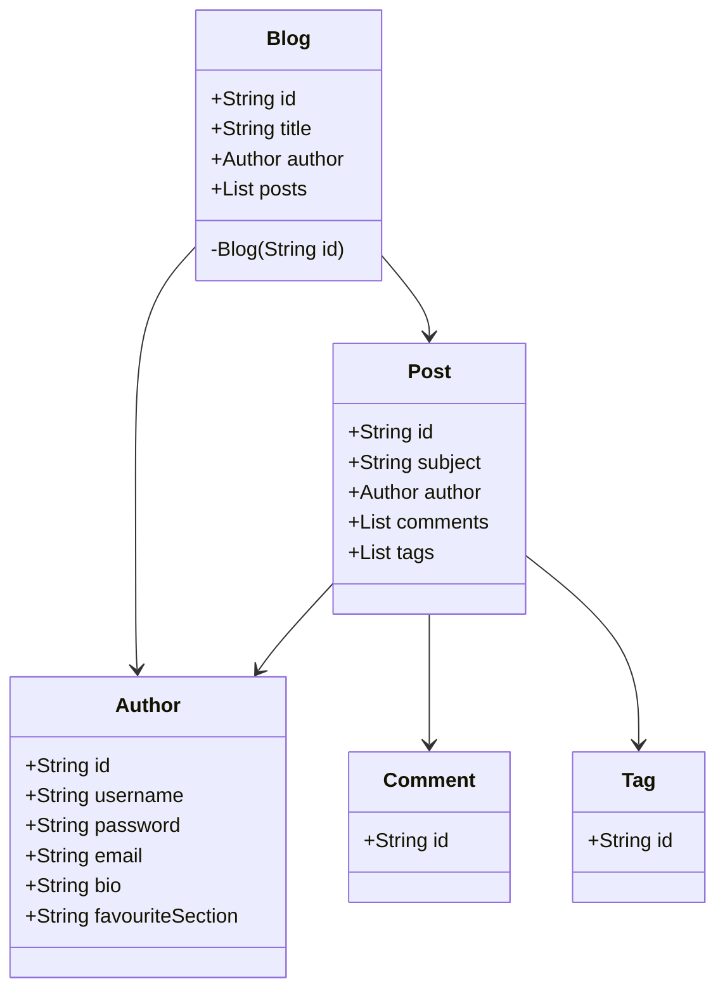

[TOC]


# XML 约束

```xml
<?xml version="1.0" encoding="UTF-8"?>
<!DOCTYPE mapper
        PUBLIC "-//mybatis.org//DTD Mapper 3.0//EN"
        "http://mybatis.org/dtd/mybatis-3-mapper.dtd">
<mapper namespace="">
    
</mapper>
```

-   `namespace`：命名空间，全类名。必填

# 2.传参


# select

## 结构

```xml
<select id="selectPerson" parameterType="int" parameterMap="deprecated"
  resultType="hashmap" resultMap="personResultMap" resultSetType="FORWARD_ONLY"
  flushCache="false" useCache="true"
  timeout="10" fetchSize="256" statementType="PREPARED">
  SELECT * FROM xxx
</select>
```

## 属性

| 属性            | 描述                                                         |
| :-------------- | :----------------------------------------------------------- |
| `id`            | 必填，DAO接口的方法名。                                      |
| `parameterType` | 可选，传入参数的类全限定名或别名。默认值为未设置（unset）。可以通过类型处理器（TypeHandler）推断出具体传入语句的参数。 |
| `resultType`    | 返回结果的类全限定名或别名。 注意，如果结果为集合，设置为集合包含的类型，而不是集合本身的类型。 resultType 和 resultMap 之间只能同时使用一个。 |
| `resultMap`     | 对外部 resultMap 的命名引用。resultType 和 resultMap 之间只能同时使用一个。 |
| `flushCache`    | 将其设置为 true 后，只要语句被调用，都会导致本地缓存和二级缓存被清空，默认值：false。 |
| `useCache`      | 将其设置为 true 后，将会导致本条语句的结果被二级缓存缓存起来，默认值：对 select 元素为 true。 |
| `timeout`       | 等待超时，默认值为未设置（unset）（依赖数据库驱动）。        |
| `fetchSize`     | 给驱动的建议值，尝试让驱动程序每次批量返回的结果行数等于这个设置值。 默认值为未设置（unset）（依赖驱动）。 |
| `statementType` | 可选，使用的语句类型（STATEMENT，PREPARED 或 CALLABLE），默认值：PREPARED。 |
| `resultSetType` | FORWARD_ONLY，SCROLL_SENSITIVE, SCROLL_INSENSITIVE 或 DEFAULT（等价于 unset） 中的一个，默认值为 unset （依赖数据库驱动）。 |
| `databaseId`    | 如果配置了数据库厂商标识（databaseIdProvider），MyBatis 会加载所有不带 databaseId 或匹配当前 databaseId 的语句；如果带和不带的语句都有，则不带的会被忽略。 |
| `resultOrdered` | 这个设置仅针对嵌套结果 select 语句：如果为 true，将会假设包含了嵌套结果集或是分组，当返回一个主结果行时，就不会产生对前面结果集的引用。 这就使得在获取嵌套结果集的时候不至于内存不够用。默认值：`false`。 |
| `resultSets`    | 仅适用于多结果集的情况。它将列出语句执行后返回的结果集并赋予每个结果集一个名称，多个名称之间以逗号分隔。 |

## 案例

```xml
<select id="selectPerson" parameterType="int" resultType="hashmap">
  SELECT * FROM PERSON WHERE ID = #{id}
</select>

<!--
对应 DAO 接口方法
	HashMap<String,Object> selectPerson(Integer id)
结果：其中的 Key 为列名, 结果对应值

#{id}：创建一个预处理语句（PreparedStatement）参数。
等价 
    String selectPerson = "SELECT * FROM PERSON WHERE ID=?";
    PreparedStatement ps = conn.prepareStatement(selectPerson);
    ps.setInt(1,id);
-->
```


# insert

## 结构

```xml
<insert id="insertAuthor" parameterType="domain.blog.Author" flushCache="true"
  statementType="PREPARED"  keyProperty="" keyColumn="" useGeneratedKeys=""
  timeout="20">
    insert into table() values()
</insert>
```

## 属性

| 属性               | 描述                                                         |
| :----------------- | :----------------------------------------------------------- |
| `id`               | 在命名空间中唯一的标识符，可以被用来引用这条语句。           |
| `parameterType`    | 将会传入这条语句的参数的类全限定名或别名。这个属性是可选的，因为 MyBatis 可以通过类型处理器（TypeHandler）推断出具体传入语句的参数，默认值为未设置（unset）。 |
| `flushCache`       | 将其设置为 true 后，只要语句被调用，都会导致本地缓存和二级缓存被清空，默认值：（对 insert、update 和 delete 语句）true。 |
| `timeout`          | 这个设置是在抛出异常之前，驱动程序等待数据库返回请求结果的秒数。默认值为未设置（unset）（依赖数据库驱动）。 |
| `statementType`    | 可选 STATEMENT，PREPARED 或 CALLABLE。这会让 MyBatis 分别使用 Statement，PreparedStatement 或 CallableStatement，默认值：PREPARED。 |
| `useGeneratedKeys` | （仅适用于 insert 和 update）这会令 MyBatis 使用 JDBC 的 getGeneratedKeys 方法来取出由数据库内部生成的主键（比如：像 MySQL 和 SQL Server 这样的关系型数据库管理系统的自动递增字段），默认值：false。 |
| `keyProperty`      | （仅适用于 insert 和 update）指定能够唯一识别对象的属性，MyBatis 会使用 getGeneratedKeys 的返回值或 insert 语句的 selectKey 子元素设置它的值，默认值：未设置（`unset`）。如果生成列不止一个，可以用逗号分隔多个属性名称。 |
| `keyColumn`        | （仅适用于 insert 和 update）设置生成键值在表中的列名，在某些数据库（像 PostgreSQL）中，当主键列不是表中的第一列的时候，是必须设置的。如果生成列不止一个，可以用逗号分隔多个属性名称。 |
| `databaseId`       | 如果配置了数据库厂商标识（databaseIdProvider），MyBatis 会加载所有不带 databaseId 或匹配当前 databaseId 的语句；如果带和不带的语句都有，则不带的会被忽略。 |

## 案例

```xml
<!-- 单条插入 -->
<insert id="insertAuthor">
  insert into Author (id,username,password,email,bio)
  values (#{id},#{username},#{password},#{email},#{bio})
</insert>

<!-- 批量插入 -->
<insert id="insertAuthor">
  insert into Author (id,username,password,email,bio)
  <foreach item="item" collection="list" separator=",">
  	values (#{id},#{username},#{password},#{email},#{bio})
  </foreach>
</insert>
```


## 主键策略

-   利用数据库的特性。部分数据库支持自动生成主键的字段（比如 MySQL 和 SQL Server）
-   使用 selectKey 手动生成主键

### 自动生成

```xml
<insert id="insertAuthor" useGeneratedKeys="true" keyProperty="id">
  insert into Author
    (username, favourite_section)
  values
    (#{username}, #{favouriteSection,jdbcType=VARCHAR})
</insert>
```

### selectKey

#### 结构

```xml
<selectKey keyProperty="id" resultType="int" order="BEFORE" statementType="PREPARED">
```

#### 属性

| 属性            | 描述                                                         |
| :-------------- | :----------------------------------------------------------- |
| `keyProperty`   | `selectKey` 语句结果应该被设置到的目标属性。使用逗号分隔多个属性名称。 |
| `keyColumn`     | 返回结果集中生成列属性的列名。使用逗号分隔多个属性名称。     |
| `resultType`    | 结果的类型<br />允许将任何简单类型用作主键的类型，包括字符串。<br />使用包含期望属性的 Object 或 Map，映射多个属性。 |
| `order`         | `BEFORE` 或 `AFTER`。如果为 `BEFORE`，先会生成主键，设置 `keyProperty` ，再执行插入语句。如果为 `AFTER`，先执行插入语句，然后执行 `selectKey` 中的语句。 |
| `statementType` | 语句类型：`STATEMENT`，`PREPARED` 和 `CALLABLE`              |

#### 案例

```xml
<insert id="insertAuthor">
  <selectKey keyProperty="id" resultType="int" order="BEFORE">
    select CAST(RANDOM()*1000000 as INTEGER) a from SYSIBM.SYSDUMMY1
  </selectKey>
  insert into Author
    (id, username, favourite_section)
  values
    (#{id}, #{username}, #{favouriteSection,jdbcType=VARCHAR})
</insert>

<!-- 
(1) 运行 selectKey 元素中的语句
(2) 设置 Author 的 id
(3) 调用插入语句
-->
```


# update

## 结构

```xml
<update id="updateAuthor" parameterType="domain.blog.Author" flushCache="true"
  statementType="PREPARED" timeout="20">
    update table set xxx = #{}
</update>
```

## 属性

| 属性            | 描述                                                         |
| :-------------- | :----------------------------------------------------------- |
| `id`            | 在命名空间中唯一的标识符，可以被用来引用这条语句。           |
| `parameterType` | 将会传入这条语句的参数的类全限定名或别名。这个属性是可选的，因为 MyBatis 可以通过类型处理器（TypeHandler）推断出具体传入语句的参数，默认值为未设置（unset）。 |
| `flushCache`    | 将其设置为 true 后，只要语句被调用，都会导致本地缓存和二级缓存被清空，默认值：（对 insert、update 和 delete 语句）true。 |
| `timeout`       | 这个设置是在抛出异常之前，驱动程序等待数据库返回请求结果的秒数。默认值为未设置（unset）（依赖数据库驱动）。 |
| `statementType` | 可选 STATEMENT，PREPARED 或 CALLABLE。这会让 MyBatis 分别使用 Statement，PreparedStatement 或 CallableStatement，默认值：PREPARED。 |

## 案例

```xml
<update id="updateAuthor">
  update Author set
    username = #{username},
    password = #{password},
    email = #{email},
    bio = #{bio}
  where id = #{id}
</update>
```


# delete

## 结构

```xml
<delete id="deleteAuthor" parameterType="domain.blog.Author" flushCache="true"
  statementType="PREPARED" timeout="20">
    delete from xxx
</delete>
```

## 属性

| 属性            | 描述                                                         |
| :-------------- | :----------------------------------------------------------- |
| `id`            | 在命名空间中唯一的标识符，可以被用来引用这条语句。           |
| `parameterType` | 将会传入这条语句的参数的类全限定名或别名。这个属性是可选的，因为 MyBatis 可以通过类型处理器（TypeHandler）推断出具体传入语句的参数，默认值为未设置（unset）。 |
| `flushCache`    | 将其设置为 true 后，只要语句被调用，都会导致本地缓存和二级缓存被清空，默认值：（对 insert、update 和 delete 语句）true。 |
| `timeout`       | 这个设置是在抛出异常之前，驱动程序等待数据库返回请求结果的秒数。默认值为未设置（unset）（依赖数据库驱动）。 |
| `statementType` | 可选 STATEMENT，PREPARED 或 CALLABLE。这会让 MyBatis 分别使用 Statement，PreparedStatement 或 CallableStatement，默认值：PREPARED。 |

## 案例

```xml
<delete id="deleteAuthor">
  delete from Author where id = #{id}
</delete>
```


# sql 片段

定义可重用的 SQL 代码片段

```xml
<sql id="userColumns">${alias}.id,${alias}.username,${alias}.password</sql>

<select id="selectUsers" resultType="map">
  select
    <include refid="userColumns">
    	<property name="alias" value="t1"/>
    </include>,
    <include refid="userColumns">
    	<property name="alias" value="t2"/>
    </include>
  from some_table t1
  cross join some_table t2
</select>

<!-- 等价 -->
<select id="selectUsers" resultType="map">
  select
    t1.id,t1.username,t1.password,
    t2.id,t2.username,t2.password
  from some_table t1
  cross join some_table t2
</select>
```


# 参数

## 隐式映射

```xml
<select id="selectUsers" resultType="User">
  select * from users where id = #{id}
</select>
<insert id="insertUser" parameterType="User">
  insert into users (id, username, password)
  values (#{id}, #{username}, #{password})
</insert>
```

## 显式指定

`#{property, javaType=xxx, jdbcType=xxx,typeHandler=xxx, numericScale=2}`

-   property：属性
-   javaType：Java类型
-   jdbcType：JDBC类型
-   typeHandler：特殊的类型处理器类（或别名）
-   numericScale：数值类型，指定小数点后保留的位数

```xml
<select id="selectUsers" resultType="User">
  select * from users 
  where age = #{age,javaType=int,jdbcType=NUMERIC,typeHandler=MyTypeHandler}
</select>
```

## 参数 # 和 ？的区别

`#`：标识该语句为预处理语句（PreparedStatement）传参。

```java
String selectPerson = "SELECT * FROM PERSON WHERE ID=?";
PreparedStatement ps = conn.prepareStatement(selectPerson);
ps.setInt(1,id);
```

`?`：标识使用普通语句（Statement）通过 SQL 拼接而成

```java
String selectPerson = "SELECT * FROM PERSON WHERE ID="+id;
Statement s = conn.statement(selectPerson);
```

## 字符串替换

默认情况下，使用 `#{}` 参数语法时，MyBatis 会创建 `PreparedStatement` 参数占位符，并通过占位符安全地设置参数（就像使用 ? 一样）。同样适用于替换表名的情况。

```java
@Select("select * from user where ${column} = #{value}")
User findByColumn(@Param("column") String column, @Param("value") String value);
// 其中 ${column} 会被直接替换，而 #{value} 会使用 ? 预处理
    
// 等价于
@Select("select * from user where name = #{name}")
User findByName(@Param("name") String name);

@Select("select * from user where email = #{email}")
User findByEmail(@Param("email") String email);
```

>   注意：用这种方式接受用户的输入，并用作语句参数是不安全的，会导致潜在的 SQL 注入攻击。
>
>   因此，要么不允许用户输入这些字段，要么自行转义并检验这些参数。


# resultMap 结果映射

## 结构

```xml
<resultMap id="" type="" autoMapping="">
  <id property="" column="" javaType="" jdbcType="" typeHandler=""/>
  <result property="" column="" javaType="" jdbcType="" typeHandler=""/>
  <constructor>
   <idArg column="" javaType="" jdbcType="" typeHandler="" select="" resultMap="" name=""/>
   <arg column="" javaType="" jdbcType="" typeHandler="" select="" resultMap="" name=""/>
  </constructor>
  <association property="" javaType="" jdbcType="" typeHandler="" column="" select="" fetchType="">
    <id property="" column="" javaType="" jdbcType="" typeHandler=""/>
    <result property="" column="" javaType="" jdbcType="" typeHandler=""/>
  </association>
  <collect >
  </collect>
</resultMap>
```

## 属性

| 属性          | 描述                                                         |
| :------------ | :----------------------------------------------------------- |
| `id`          | 唯一标识，用于标识一个结果映射。                             |
| `type`        | 类的完全限定名, 或者一个类型别名                             |
| `autoMapping` | 如果设置这个属性，MyBatis 将会为本结果映射开启或者关闭自动映射。 这个属性会覆盖全局的属性 autoMappingBehavior。默认值：未设置（unset）。 |



```xml
<select id="selectBlogDetails" resultMap="detailedBlogResultMap">
  select
       B.id as blog_id,
       B.title as blog_title,
       B.author_id as blog_author_id,
       A.id as author_id,
       A.username as author_username,
       A.password as author_password,
       A.email as author_email,
       A.bio as author_bio,
       A.favourite_section as author_favourite_section,
       P.id as post_id,
       P.blog_id as post_blog_id,
       P.author_id as post_author_id,
       P.created_on as post_created_on,
       P.section as post_section,
       P.subject as post_subject,
       P.draft as draft,
       P.body as post_body,
       C.id as comment_id,
       C.post_id as comment_post_id,
       C.name as comment_name,
       C.comment as comment_text,
       T.id as tag_id,
       T.name as tag_name
  from Blog B
       left outer join Author A on B.author_id = A.id
       left outer join Post P on B.id = P.blog_id
       left outer join Comment C on P.id = C.post_id
       left outer join Post_Tag PT on PT.post_id = P.id
       left outer join Tag T on PT.tag_id = T.id
  where B.id = #{id}
</select>
```


```xml
<resultMap id="detailedBlogResultMap" type="Blog">
  <constructor>
    <idArg column="blog_id" javaType="int"/>
  </constructor>
  <result property="title" column="blog_title"/>
  <association property="author" javaType="Author">
    <id property="id" column="author_id"/>
    <result property="username" column="author_username"/>
    <result property="password" column="author_password"/>
    <result property="email" column="author_email"/>
    <result property="bio" column="author_bio"/>
    <result property="favouriteSection" column="author_favourite_section"/>
  </association>
  <collection property="posts" ofType="Post">
    <id property="id" column="post_id"/>
    <result property="subject" column="post_subject"/>
    <association property="author" javaType="Author"/>
    <collection property="comments" ofType="Comment">
      <id property="id" column="comment_id"/>
    </collection>
    <collection property="tags" ofType="Tag" >
      <id property="id" column="tag_id"/>
    </collection>
    <discriminator javaType="int" column="draft">
      <case value="1" resultType="DraftPost"/>
    </discriminator>
  </collection>
</resultMap>
```

## id & result

属性

# 自动映射

# cache 缓存

mar