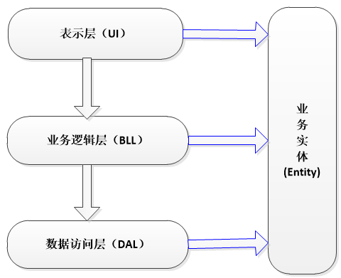
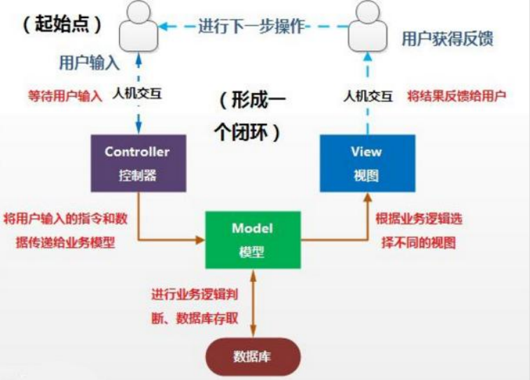
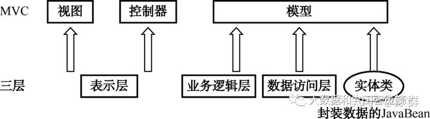

[TOC]


# 1.框架

## 1.1 什么是框架

框架（Framework）是软件开发中的一套解决方案，将整个或部分系统的可重用部分设计成一组抽象构件及构件实例间交互的方法;

优点：将已有的技术整合，提供底层实现，应用开发只需要关注自身的设计和具体的业务，实现技术解耦。

## 1.2 三层架构

`表示层(USL, User Show Layer)`：用于显示数据和接收用户输入的数据，为用户提供一种交互式操作的界面。

`业务逻辑层(BBL, Bussiness Logic Layer)`：用于对业务数据的封装，包含了一定的业务逻辑。

`数据访问层(DAL, Data Access Layer)`：持久层，直接操作数据库，对数据进行增删改查等原子性操作。



## 1.3 MVC 设计模式

`Model 模型层`：模型持有所有的数据、状态和程序逻辑。模型接受视图数据的请求，并返回最终的处理结果。

`View 视图层`：负责界面的显示，以及与用户的交互功能，例如表单、网页等。

`Controller 控制层`：用来决定对于视图发来的请求，需要用哪一个模型来处理，以及处理完后需要跳回到哪一个视图。即用来连接视图和模型。




## 三层架构和MVC之间的关系



## 1.4 常见框架

`Spring`：管理整个应用中所有 Bean 的生命周期行为（对象的创建、初始化、销毁，及对象间关联关系的维护)。

`SpringMVC`：

-   View 层：完成用户的请求接收功能。
-   Controller 层：完成用户请求的转发及对用户的响应。

`Mybatis`：

-   Model 层：完成对数据库的增、删、改、查功能。

# 2.JDBC编程

## 2.1 常见步骤

-   加载数据库驱动
-   建立连接
-   预处理语句
-   向数据库发起请求
-   处理结果
-   释放资源

```java
Connection connection = null;
PreparedStatement preparedStatement = null;
ResultSet resultSet = null;
try {
    // 加载数据库驱动
    Class.forName("com.mysql.jdbc.Driver");
    // 通过驱动管理类获取数据库链接
    connection = DriverManager.getConnection("jdbc:mysql://localhost:3306/mysql?characterEncoding=utf-8", "root", "123456");
    // 定义 sql 语句 ? 表示占位符
    String sql = "select * from user where user = ?";
    // 获取预处理 statement
    preparedStatement = connection.prepareStatement(sql);
    // 设置参数，第一个参数为 sql 语句中参数的序号（从 1 开始），第二个参数为设置的参数值
    preparedStatement.setString(1, "root");
    // 向数据库发出 sql 执行查询，查询出结果集
    resultSet = preparedStatement.executeQuery();
    // 遍历查询结果集
    while (resultSet.next()) {
        log.info("The User [{}], authentication_string [{}]", resultSet.getString("User"),
                 resultSet.getString("authentication_string"));
    }
} catch (Exception e) {
    log.error("Failed to execute the sql.", e);
} finally {
    // 释放资源
    CommonUtils.close(resultSet);
    CommonUtils.close(preparedStatement);
    CommonUtils.close(connection);
}
```


-   `jdbc.driver`：com.mysql.jdbc.Driver
-   `jdbc.url`：jdbc:mysql://localhost:3306/mysql?characterEncoding=utf-8
-   jdbc.username：root
-   jdbc.password：123456


## 2.2 存在的缺点

-   数据库链接创建、释放频繁造成系统资源浪费从而影响系统性能。【数据库连接池】 
-   Sql 语句在代码中硬编码，造成代码不易维护。【Mapper 映射】
-   使用 PreparedStatement 向占有位符号传参数存在硬编码。【Mybatis 动态SQL】 
-   对结果集解析存在硬编码（查询列名）【使用结果集映射，转换为对应的POJO对象】