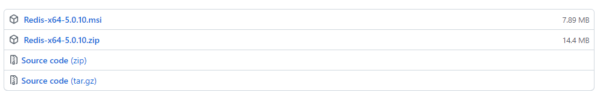

# 2.安装部署

## 2.1 Linux 安装部署

### 2.1.1 安装部署

下载路径：[http://download.redis.io/releases/](http://download.redis.io/releases/)

**步骤1**：环境准备

```shell
yum install cpp -y 
yum install binutils -y
yum install glibc-kernheaders -y
yum install glibc-common -y
yum install glibc-devel -y
yum install gcc -y
yum install make -y
```

**步骤2**：安装部署

```shell
# 下载
wget http://download.redis.io/releases/redis-6.0.8.tar.gz
# 解压
tar -zvxf redis-6.0.8.tar.gz
# 移动位置
mv redis-6.0.8 /usr/local
cd /usr/local/redis-6.0.8
# 编译
make
# 安装
make PREFIX=/usr/local/redis-6.0.8 install
```

**步骤3**：配置 redis.config

-   bind host：绑定主机，默认 127.0.0.1
-   port 6379：指定端口，默认6379
-   requirepass 123456：指定密码，默认为空
-   daemonize yes：守护线程执行，后台启动，默认 no

**步骤4**：启动

```shell
cd /usr/local/redis-6.0.8

# 后台运行
# 方式一: 加上 &, 启动后 Ctrl+C 退出
./bin/redis-server & redis.conf
# 方式二: 修改配置文件 redis.config, 配置 daemonize 为 yes
./bin/redis-server redis.conf

# 查看进程
ps -ef|gerp redis
```

**步骤5**：客户端连接

```shell
cd /usr/local/redis-6.0.8
redis-cli -h host -p prot [-a password] [--raw]
# --raw：避免中文乱码

# 设置字符串 KV
set test test
# 获取键值
get test
# 查看符合的键
keys *
# 清空 KV
flushall
```

**步骤6**：停止服务

-   方式一：通过客户端发送命令，断开连接，服务器关闭服务，生成持久化文件

```shell
redis-cli -h host -p prot [-a password]
shutdown
```

-   方式二：服务端不会持久化，还会造成缓冲区非法关闭，可能会造成AOF和丢失数据

```she
kill -9 pid
```

### 2.1.2 工具说明

| 可执行文件       | 作用                        |
| ---------------- | --------------------------- |
| redis-server     | 启动redis                   |
| redis-cli        | redis命令行客户端           |
| redis-benchmark  | 基准测试工具                |
| redis-check-aof  | AOF持久化文件检测和修复工具 |
| redis-check-dump | RDB持久化文件检测和修复工具 |
| redis-sentinel   | 启动哨兵                    |
| redis-trib       | cluster集群构建工具         |

## 2.2 Windows 安装部署

下载路径：[https://github.com/tporadowski/redis/releases](https://github.com/tporadowski/redis/releases)



```powershell
# 解压 Redis-x64-5.0.10.zip
.\redis-server.exe redis.windows.conf
# 打开另一个命令窗口
.\redis-cli.exe -h 127.0.0.1 -p 6379 [-a password] [--raw] # 
```


## 2.3 redis.conf 配置

### 2.3.1 配置说明

| 配置项             | 说明                                                         |
| ------------------ | ------------------------------------------------------------ |
| bind host          | 绑定主机，默认 127.0.0.1                                     |
| port 6379          | 指定端口，默认6379                                           |
| requirepass 123456 | 指定密码，默认为空。<br/>- 登录时配置参数 -a passwd <br/>- 登录后执行命令 auth passwd |
| daemonize yes      | 后台启动，默认 no                                            |

### 2.3.2 修改配置方式

-   热修改，重启后失效

```shell
# 登录客户端
# 查看所有配置项
config get *
# 查看具体配置项
config get loglevel
# 设置配置项值
config set loglevel xxx
```

-   修改配置文件，重启后依旧生效