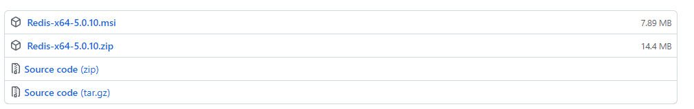

# 1.简介

## 1.1 什么是Redis

基于 **KV 键值对**的**内存**数据库，支持 如下几种类型的数据结构

-   string：最基础的数据类型，二进制安全，最大存储 512 MB
-   hash：类似 Map 数据结构
-   list：有序列表，可重复
-   set：无序集合，不重复
-   zset：有序集合，分数排序，不重复

同时提供键过期、发布订阅、（弱）事务，通道（Pipeline）等附加功能，也支持基于 Lua 脚本。

## 1.2 什么是 Redis 数据库？

Redis支持多个数据库，并且每个数据库的数据是隔离的不能共享，并且基于单机才有，如果是集群就没有数据库的概念。

## 1.3 Redis 的优点和缺点

优点：

-   速度快
    -   数据结构简单，且数据存放在内存，可以直接读写
    -   底层由 C 语言实现，更适用于系统
    -   单线程结构，避免了不必要的上下文切换及竞争条件
    -   网络层使用多路I/O复用模型，非阻塞IO解决高并发问题
-   简单稳定：单线程
-   丰富的数据类型
-   持久化：支持`RDB`和`AOF`两种方式
-   高可用和分布式：哨兵机制实现高可用，保证redis节点故障发现和自动转移
-   主从复制：实现多个相同数据的redis副本
-   客户端支持多种语言：Java、PHP、Python、C/C++、NodeJs 等

缺点：

-   耗内存：短时间的大量增加数据，可能导致内存不足。

## 1.4 Redis 使用场景

-   数据缓存，加快访问速度，降低数据库的压力
-   排行榜：主要用列表和有序集合的特性来实现排序
-   计数器：视频网站播放数，网站浏览数
-   消息队列：基于发布订阅功能（实用性不大）


# 2.安装部署

## 2.1 Linux 安装部署

### 2.1.1 安装部署

下载路径：[http://download.redis.io/releases/](http://download.redis.io/releases/)

**步骤1**：环境准备

```shell
yum install cpp -y 
yum install binutils -y
yum install glibc-kernheaders -y
yum install glibc-common -y
yum install glibc-devel -y
yum install gcc -y
yum install make -y
```

**步骤2**：安装部署

```shell
# 下载
wget http://download.redis.io/releases/redis-6.0.8.tar.gz
# 解压
tar -zvxf redis-6.0.8.tar.gz
# 移动位置
mv redis-6.0.8 /usr/local
cd /usr/local/redis-6.0.8
# 编译
make
# 安装
make PREFIX=/usr/local/redis-6.0.8 install
```

**步骤3**：配置 redis.config

-   bind host：绑定主机，默认 127.0.0.1
-   port 6379：指定端口，默认6379
-   requirepass 123456：指定密码，默认为空
-   daemonize yes：守护线程执行，后台启动，默认 no

**步骤4**：启动

```shell
cd /usr/local/redis-6.0.8

# 后台运行
# 方式一: 加上 &, 启动后 Ctrl+C 退出
./bin/redis-server & redis.conf
# 方式二: 修改配置文件 redis.config, 配置 daemonize 为 yes
./bin/redis-server redis.conf

# 查看进程
ps -ef|gerp redis
```

**步骤5**：客户端连接

```shell
cd /usr/local/redis-6.0.8
redis-cli -h host -p prot [-a password] [--raw]
# --raw：避免中文乱码

# 设置字符串 KV
set test test
# 获取键值
get test
# 查看符合的键
keys *
# 清空 KV
flushall
```

**步骤6**：停止服务

-   方式一：通过客户端发送命令，断开连接，服务器关闭服务，生成持久化文件

```shell
redis-cli -h host -p prot [-a password]
shutdown
```

-   方式二：服务端不会持久化，还会造成缓冲区非法关闭，可能会造成AOF和丢失数据

```she
kill -9 pid
```

### 2.1.2 工具说明

| 可执行文件       | 作用                        |
| ---------------- | --------------------------- |
| redis-server     | 启动redis                   |
| redis-cli        | redis命令行客户端           |
| redis-benchmark  | 基准测试工具                |
| redis-check-aof  | AOF持久化文件检测和修复工具 |
| redis-check-dump | RDB持久化文件检测和修复工具 |
| redis-sentinel   | 启动哨兵                    |
| redis-trib       | cluster集群构建工具         |

## 2.2 Windows 安装部署

下载路径：[https://github.com/tporadowski/redis/releases](https://github.com/tporadowski/redis/releases)



```powershell
# 解压 Redis-x64-5.0.10.zip
.\redis-server.exe redis.windows.conf
# 打开另一个命令窗口
.\redis-cli.exe -h 127.0.0.1 -p 6379 [-a password] [--raw] # 
```


## 2.3 redis.conf 配置

### 2.3.1 配置说明

| 配置项             | 说明                                                         |
| ------------------ | ------------------------------------------------------------ |
| bind host          | 绑定主机，默认 127.0.0.1                                     |
| port 6379          | 指定端口，默认6379                                           |
| requirepass 123456 | 指定密码，默认为空。<br/>- 登录时配置参数 -a passwd <br/>- 登录后执行命令 auth passwd |
| daemonize yes      | 后台启动，默认 no                                            |

### 2.3.2 修改配置方式

-   热修改，重启后失效

```shell
# 登录客户端
# 查看所有配置项
config get *
# 查看具体配置项
config get loglevel
# 设置配置项值
config set loglevel xxx
```

-   修改配置文件，重启后依旧生效


# 3.数据类型

支持五种数据类型：string、hash、list、set和zset。

| 类型   | 简介                                            | 特性                                                         | 场景                                                         |
| :----- | :---------------------------------------------- | :----------------------------------------------------------- | :----------------------------------------------------------- |
| string | 二进制安全，基础类型，，最大能存储 512 M        | 可以包含任何数据（例如：图片，序列化对象等）                 |                                                              |
| hash   | 键值对集合，类似 Map，可以存储 2^32 -1 个键值对 | 适合存储对象，支持只修改某一项属性值                         | 存储、读取、修改用户属性                                     |
| list   | 链表(双向链表)，可以存储 2^32 -1 个元素         | 增删快                                                       | - 最新消息排行等功能<br/>- 消息队列                          |
| set    | 哈希表，可以存储 2^32 -1 个元素                 | 无序集合，唯一不重复。<br>增删改<br/>集合求交集、并集、差集等操作 | - 共同好友<br/>- 统计访问网站的所有独立ip<br/>- 好友推荐时,根据tag求交集，大于某个阈值就可以推荐 |
| zset   | 哈希表，有序集合，成员不重复。                  | 将Set中的元素增加一个权重参数 score，元素按 score 有序从小到大的排除 | - 排行榜<br/>- 带权重的消息队列                              |


## 3.1 string

| 命令                                                   | 描述                                                         |
| ------------------------------------------------------ | ------------------------------------------------------------ |
| SET key value [EX seconds / PX milliseconds] [NX / XX] | 设置键值<br />- EX：n秒后过期<br/>- PX：n毫秒后过期<br/>- NX：键不存在<br/>- XX：键存在 |
| SETNX key value                                        | 设置键值<br />设置成功，返回1<br/>键存在，返回 0             |
| SETEX key seconds value                                | 设置键值和过期时间，以秒计                                   |
| PSETEX key milliseconds value                          | 设置键值和过期时间，以毫秒计                                 |
| GET key                                                |                                                              |
| GEYSET key value                                       | 获取旧值，替换新值<br />- 没有旧值返回 nil<br />- 键不存在或不是字符串时返回错误 |
| SETRANGE key offset value                              | 从偏移量 offset 开始，替换字符串，并返回被修改后的字符串长度。<br />- offset：0~n |
| GETRANGE key start end                                 | 返回 key 中字符串值的子字符<br />- start：起始位，为负标识倒序，超过长度限制则返回空字符串<br />- end：结束位，为负标识倒序，可超过字符串长度 |
| GETBIT key offset                                      | 获取键值指定偏移量上的位(bit)<br />- offset：0~n             |
| SETBIT key offset value                                | 设置或清除键值指定偏移量上的位(bit)<br />- offset：0~n       |
| MSET key value [key value ...]                         | 批量设置键值对<br />返回 1\|0                                |
| MSETNX key value [key value ...]                       | 批量设置键值对，如果某键存在，则全部失败<br />返回 1\|0      |
| MGET key [key ...]                                     | 获取所有(一个或多个)给定 key 的值。                          |
| STRLEN key                                             | 返回 key 所储存的字符串值的长度。                            |
| append key value                                       | 将指定的 value 追加到该 key 原来 value 的末尾（键存在且为string 类型） |
| INCR key                                               | 键值+1                                                       |
| INCRBY key increment                                   | 键值增加给定的增量值（increment）                            |
| INCRBYFLOAT key increment                              | 键值增加给定的浮点增量值（increment）                        |
| DECR key                                               | 键值-1                                                       |
| DECRBY key decrement                                   | 键值减去给定的减量值（decrement）                            |


## 3.2 hash

| 命令                                           | 描述                                                         |
| ---------------------------------------------- | ------------------------------------------------------------ |
| HMSET key field value [field value ...]        | 批量增加字段                                                 |
| HSET key field value                           | 增加字段                                                     |
| HSETNX key field value                         | 增加字段，字段不存在                                         |
| HDEL key field [field...]                      | 删除字段                                                     |
| HEXSIST key field                              | 字段是否存在                                                 |
| HLEN key                                       | 字段数量                                                     |
| HKEYS key                                      | 获取所有字段                                                 |
| HGETALL key                                    | 获取所有字段和值                                             |
| HGET key field                                 | 获取指定字段的值                                             |
| HMGET key field [field...]                     | 获取所有指定字段的值                                         |
| HINCREBY key field increment                   | +n                                                           |
| HINCREBYFLOAT key field increment              | +n（浮点）                                                   |
| HSCAN key cursor [MATCH pattern] [COUNT count] | 基于游标的迭代器迭代哈希表中的键值对，返回一个新的游标和集合<br />- cursor：游标<br />- pattern：匹配模式<br />- count：指定返回多少数据，默认10 |


## 3.3 list

| 命令                                  | 描述                                                         |
| ------------------------------------- | ------------------------------------------------------------ |
| LPUSH key value [value...]            | 将一个或多个值插入到列表头部                                 |
| LPUSHX key value [value...]           | 将一个或多个值插入到**已存在**的头部                         |
| RPUSH key value [value...]            | 将一个或多个值追加到列表尾部                                 |
| RPUSHX key value [value...]           | 将一个或多个值追加到**已存在**的列表尾部                     |
|                                       |                                                              |
| LPOP key                              | 移出并获取列表第一个元素                                     |
| RPOP key                              | 移出并获取列表最后一个元素                                   |
| BLPOP key1 [key2] timeout             | 移出并获取列表的第一个元素<br />如果列表没有元素会阻塞列表直到等待超时或发现可弹出元素为止。 |
| BRPOP key1 [key2] timeout             | 移出并获取列表的最后一个元素<br />如果列表没有元素会阻塞列表直到等待超时或发现可弹出元素为止。 |
| RPOPLPUSH srcList destList            | 移除列表的最后一个元素，并将该元素添加到另一个列表并返回     |
| BRPOPLPUSH srcList destList timeout   | 从列表中弹出一个值，将弹出的元素插入到另外一个列表中并返回它； <br />如果列表没有元素会**阻塞列表**直到等待超时或发现可弹出元素为止。 |
|                                       |                                                              |
| LLEN key                              | 获取列表的长度                                               |
| LSET key index value                  | 设置列表指定位置的值                                         |
| LTRIM key start stop                  | 保留指定范围的列表                                           |
| LINDEX key index                      | 获取指定位置的元素                                           |
| LRANGE key start stop                 | 获取列表指定范围的元素                                       |
| LREM key count value                  | 从列表中删除 count 与 value 相同的元素<br />count > 0：从列头开始搜索<br />count < 0：从列尾开始搜索<br />count = 0：移除所有相同值 |
| LINSERT key BEFORE\|AFTER pivot value | 将 value 插入到 pivot 之前或者                               |


## 3.4 set

| 命令                                       | 描述                                                         |
| ------------------------------------------ | ------------------------------------------------------------ |
| SADD key member [member ...]               | 向集合添加一个或多个成员                                     |
| SCARD key                                  | 获取结合成员数                                               |
| SMEMBERS key                               | 返回集合中的所有成员                                         |
| SISMEMBER key member                       | 判断 member 元素是否是集合 key 的成员                        |
|                                            |                                                              |
| SINTER key1 [key ...]                      | 返回 key1 与其他集合之间的交集                               |
| SUNION key [key ...]                       | 返回所有给定集合的并集                                       |
| SUNIONSTORE dest key [key ...]             | 所有给定集合的并集存储在 dest 集合中                         |
| SDIFF key1 [key ...]                       | 返回 key1 与其他集合之间的差集                               |
| SDIFFSTORE dest key [key ...]              | 返回给定所有集合的差集并存储在 dest 中                       |
|                                            |                                                              |
| SPOP key                                   | 移除并返回集合中的一个**随机**元素                           |
| SREM key member [member ...]               | 移除集合中一个或多个成员                                     |
| SRANDMEMBER key [count]                    | 返回集合中一个或多个随机数                                   |
| SMOVE src dest member                      | 将 member 元素从 source 集合移动到 destination 集合          |
|                                            |                                                              |
| SSCAN cursor [MATCH pattern] [COUNT count] | 基于游标的迭代器迭代集合中的元素，返回一个新的游标和元素集合<br />- cursor：游标<br />- pattern：匹配模式<br />- count：指定返回多少数据，默认10 |

**规则**：

- sadd (常用于标签) 
- spop/srandmember(随机，比如抽奖) 
- sadd+sinter (用于社交，查询共同爱好的人，匹配)

## 3.5 zset

| 命令                                                         | 描述                                                         |
| ------------------------------------------------------------ | ------------------------------------------------------------ |
| ZADD key score member [score member ...]                     | 向有序集合添加一个或多个成员，或者更新已存在成员的分数       |
| ZCARD key                                                    | 获取有序集合的成员数                                         |
| ZCOUNT key min max                                           | 指定区间分数的成员数                                         |
| ZLEXCOUNT key min max                                        | 指定字典区间内成员数量                                       |
| ZSCORE key member                                            | 返回有序集中，成员的分数值                                   |
| ZINCRBY key increment member                                 | 指定成员的分数加上增量 increment                             |
|                                                              |                                                              |
| ZINTERSTORE dest countKeys key [key ...]                     | 计算指定个数的有序集的交集<br />将结果集存储在新的有序集合 dest 中 |
| ZUNIONSTORE dest countKeys key [key ...]                     | 计算给定的一个或多个有序集的并集，并存储在新的 key 中        |
|                                                              |                                                              |
| ZRANGE key start stop [withscopres]                          | 通过索引区间返回有序集合指定区间内的成员                     |
| ZRANGEBYLEX key min max [LIMIT offset count]                 | 通过字典区间返回有序集合的成员                               |
| ZRANGEBYSCORE key min max [withscopres] [LIMIT offset count] |                                                              |
|                                                              |                                                              |
| ZRANK key member                                             | 返回有序集合中指定成员的索引                                 |
|                                                              |                                                              |
| ZREM key member [member ...]                                 | 移除有序集合中的一个或多个成员                               |
| ZREMRANGEBYLEX key min max                                   | 移除有序集合中给定的字典区间的所有成员                       |
| ZREMRANGEBYRANK key star stop                                | 移除有序集合中给定的排名区间的所有成员                       |
| ZREMRANGEBYSCORE key star stop                               | 移除有序集合中给定的分数区间的所有成员                       |
|                                                              |                                                              |
| ZREVRANGE key start stop [withscopres]                       | 返回有序集中指定区间内的成员，通过索引，分数从高到低         |
| ZREVRANGEBYSCORE key start stop [withscopres]                | 返回有序集中指定分数区间内的成员，分数从高到低排序           |
| ZREVRANK key member                                          | 返回有序集合中指定成员的排名，有序集成员按分数值递减(从大到小)排序 |
|                                                              |                                                              |
| ZSCAN cursor [MATCH pattern] [COUNT count]                   | 基于游标的迭代器迭代集合中的有序集合中的元素（包括元素成员和元素分值），返回一个新的游标和元素集合<br />- cursor：游标<br />- pattern：匹配模式<br />- count：指定返回多少数据，默认10 |


# 4.Redis 其他命令

## 4.1 连接命令

| 命令          | 描述               |
| ------------- | ------------------ |
| auth password | 验证密码是否正确   |
| echo message  | 打印字符串         |
| ping          | 查看服务是否运行   |
| quit          | 关闭当前链接       |
| select index  | 切换到指定的数据库 |


## 4.2 键相关命令

| 命令                                      | 描述                                                         | 样例                        |
| ----------------------------------------- | ------------------------------------------------------------ | --------------------------- |
| TYPE key                                  | 查看对应值的存储类型。<br />string/hash/list/set/zset/none   |                             |
| EXISTS key                                | 检查 key 是否存在。返回 1\|0                                 |                             |
| KEYS pattern                              | 查找所有符合模式( pattern)的 key                             | KEYS *                      |
| DEL key [key ...]                         | 删除 key。返回删除键的数量                                   |                             |
| FLUSHDB                                   | 只清空**当前数据库**的键值对                                 |                             |
| FLUSHALL                                  | 清空**所有库**的键值对                                       |                             |
| RENAME key newkey                         | 重命名。<br />改名成功提示 OK<br />失败（键名相同或键不存在）返回一个错误。newkey 已存在其值被覆盖 |                             |
| REMAMENX  key newkey                      | 重命名<br />修改成功时，返回 1 。<br /> newkey 已经存在，返回 0 。 |                             |
| EXPIRE key seconds                        | 设置过期时间，以秒计。返回 1\|0                              | EXPIREAT test 1             |
| PEXPIRE key milliseconds                  | 设置过期时间，以毫秒计。返回 1\|0                            | EXPIREAT test 1000          |
| EXPIREAT key timestamp                    | 设置过期时间，时间戳，以秒计。<br />返回 1\|0                | EXPIREAT test 1631846625    |
| PEXPIREAT key ms-timestamp                | 设置过期时间，时间戳，以毫秒计。<br />返回 1\|0              | EXPIREAT test 1631846625000 |
| TTL key（time to live）                   | 返回 key 的剩余生存时间，以秒计。-1：持久存在                |                             |
| PTTL key                                  | 返回 key 的剩余生存时间，以毫秒计。-1：持久存在              |                             |
| PERSIST key                               | 移除 key 的过期时间                                          |                             |
| DUMP key                                  | 序列化 key。返回被序列化的值                                 |                             |
| MOVE key db_index                         | 将当前数据库的 key 移动到给定的数据库 db 当中。返回 1\|0     |                             |
| RANDOMKEY                                 | 从当前数据库中随机返回一个 key。当不存在键时，返回 nil。     |                             |
| SCAN cursor [MATCH pattern] [COUNT count] | 基于游标的迭代器迭代数据库中的键，返回一个新的游标和键集<br />- cursor：游标<br />- pattern：匹配模式<br />- count：指定返回多少数据，默认10 |                             |


# 5.HyperLogLog 结构

## 5.1 什么是 HyperLogLog？

**作用**：用于`基数`统计的算法。

**优点**：输入元素的数量或者体积非常非常大时，计算基数所需的空间总是固定 的、并且是很小的。每个 HyperLogLog 键只需要花费 12 KB 内存，就可以计算接近 2^64 个不同元素的基数。但是HyperLogLog 只会根据输入元素来计算基数，而不会储存输入元素本身，所以 HyperLogLog 不能像集合那样，返回输入的各个元素。

>  **什么是基数？**
>
>  比如数据集 {1, 3, 5, 7, 5, 7, 8}， 那么这个数据集的基数集为 {1, 3, 5 ,7, 8}, 基数(不重复元素)为5。 基数估计就是在误差可接受的范围内，快速计算基数。

## 5.2 相关命令

| 命令                                      | 描述                                      |
| ----------------------------------------- | ----------------------------------------- |
| PFADD key element [element ...]           | 添加元素到 HyperLogLog 中                 |
| PFCOUNT key [key]                         | 返回给定 HyperLogLog 的基数估算值         |
| PFMERGE destkey sourcekey [sourcekey ...] | 将多个 HyperLogLog 合并为一个 HyperLogLog |

测试：

```shell
pfadd hL1 a b c d
pfcount hL1
# (integer) 4

pfadd hL2 a b e f
pfcount hL2
# (integer) 4

pfcount hL1 hL2
# (integer) 6

pfmerge hL3 hL1 hL2
pfcount hL3
# (integer) 6
```


# 6.发布订阅

## 6.1 什么是发布订阅？

 发布订阅 (pub/sub) 是一种消息通信模式：发送者 (pub) 发送消息，订阅者 (sub) 接收消息

客户端可以订阅任意数量的频道。

## 6.2 相关命令

| 命令                                      | 描述                     |
| ----------------------------------------- | ------------------------ |
| subscribe channel [channel ...]           | 订阅给定的频道           |
| psubscribe pattern [pattern ...]          | 订阅符合给定模式的频道。 |
| unsubscribe channel [channel ...]         | 退订给定的频道           |
| punsubscribe pattern [pattern ...]        | 退订符合给定模式的频道。 |
| pubsub subcommand argument [argument ...] | 查看订阅与发布系统状态。 |
| publish channel message                   | 将信息发送到指定的频道。 |

测试：

redis-cli sub A

```shell
subscribe cpub
# 1) "subscribe"
# 2) "cpub"
# 1) "message"
# 3) (integer) 1
# 1) "message"
# 2) "cpub"
# 3) "test"
```


redis-cli sub B

```shell
subscribe cpub
# 1) "subscribe"
# 2) "cpub"
# 3) (integer) 1
# 1) "message"
# 2) "cpub"
# 3) "test"
```


redis-cli pub

```shell
publish cpub test
# (integer) 2
```


# 7.事务

## 7.1 什么是事务？

事务是指是程序中一系列严密的逻辑操作，而且所有操作必须全部成功完成，否则在每个操作中所作的所有更改都会被撤消。

### 7.1.1 四大特性

- A（Atomicity）：原子性
- C（Consistency）：一致性
- I（Isolation）：隔离性
- D（Durability）：持久性

### 7.1.2 隔离级别

- Read uncommitted：读未提交。
- Read committed：读提交。
- Repeatable read：重复读。
- Serializable：序列化


## 7.2 什么是 Redis 事务？

> 事务可以一次执行多个命令， 并且带有以下两个重要的保证：
>
> - 事务是一个**单独的隔离**操作
>     - 事务中的所有命令都会**序列化**、**按顺序**地执行。
>     - 事务在执行的过程中，不会被其他客户端发送来的命令请求所打断。
> - 事务是一个原子操作：事务中的命令要么全部被执行，要么全部都不执行

说明

- 批量操作在发送 EXEC 命令前被放入队列缓存。
- 收到 EXEC 命令后进入事务执行，事务中**任意命令执行失败，其余的命令依然被执行**。
- 在事务执行过程，其他客户端提交的命令请求不会插入到事务执行命令序列中。（本质是一组命令的集合。一个事务中的所有命令都会序列化，按顺序地串行化执行而不会被其它命令插入）


## 7.3 Redis 事务的三个阶段

- 开始事务（multi）
- 命令入队（command）
- 执行事务（exec）或取消事务（discard）

| 命令    | 描述                                 |
| ------- | ------------------------------------ |
| multi   | 标记事务块的开始                     |
| exec    | 执行事务块内所有的命令               |
| discard | 取消事务，放弃执行事务块内的所有命令 |

测试：

```shell
multi
# OK
set tSet "a"
# QUEUED
get tSet
# QUEUED
sadd tSzet "b"
# QUEUED
smembers tSzet
#QUEUED
exec
# 1) OK
# 2) "a"
# 3) (integer) 1
# 4) 1) "b"
```


## 7.4 带 Watch 的事务

作用：在事务开始之前监视任意数量的键，当调用`EXEC`命令执行事务时， 如果任意一个被监视的键已经被其他客户端修改了， 那么整个事务将被打断，不再执行， 直接返回失败。

- watch 命令可以被调用多次

- 对键的监视从 watch 执行之后开始生效， 直到调用 exec 为止（不管事务是否成功执行，所有键的监视都会被取消）
- 当客户端断开连接时， 该客户端对键的监视也会被取消

| 命令                | 描述                                                 |
| ------------------- | ---------------------------------------------------- |
| watch key [key ...] | 监听key。如果事务执行之前，key发生变动，事务将被打断 |
| unwatch             | 取消对所有 key 的监视                                |

测试：用户A和用户B使用同一个银行卡消费

不使用 watch 的事务

```shell
# 用户A 充值 100
set balance 100
# "OK"

# 用户B 购物 100
multi
decrby balance 100

# 用户A 同时消费 100
decrby balance 100
# (integer) 0 余额清空

# 用户B 结账 100
exec
# 1) (integer) -100 消费成功，余额为负
```

使用 watch 的事务

```shell
# 用户A 充值 100
set balance 100
# "OK"

# 用户B 购物 100
watch balance
multi
decrby balance 100

# 用户A 同时消费 100
decrby balance 100
# (integer) 0 余额清空

# 用户B 结账 100
exec
# (nil) 执行失败

# 用户B 查看余额
get balance
# "0"
```


## 7.5 小结

### 7.5.1 3个阶段

- 开启事务：`mulit`
- 入队：多个命令入队到事务队列中，并不会立即执行
- 执行触发事务： `exec` 命令触发事务

### 7.5.2 3个特性

- **隔离性**：事务中的所有命令都会序列化、按顺序地执行。事务在执行的过程中，不会被其他客户端发送来的命令请求所打断。
- **不保证原子性**：**单个 Redis 命令的执行是原子性的**，但是同一个事务中如果有一条命令执行失败，其后的命令仍然会被执行，没有回滚

## 7.6 拓展

### watch 事务的实现原理

- [不支持原子性的 Redis 事务也敢叫事务？](https://zhuanlan.zhihu.com/p/235466985)


# 8.Lua 脚本

## 8.1 什么是 Lua 脚本？


## 8.2 相关命令

| 命令                                             | 描述                                                         |
| ------------------------------------------------ | ------------------------------------------------------------ |
| EVAL script numkeys key [key ...] arg [arg ...]  | 使用 Lua 解释器执行脚本<br />- **script**: Lua 脚本程序<br/>- **numkeys**：指定参数个数<br/>- **key [key ...]**：用到的Redis 键，通过全局变量KEYS[1~N]数组获取键名<br/>- **arg [arg ...]**：附加参数，通过全局变量ARGV[1~N]数组获取 |
| evalsha sha1 numkeys key [key ...] arg [arg ...] | 根据给定的 sha1 校验码，执行缓存在服务器中的脚本<br />- **sha1** ： 通过 script load 命令 生成的 sha1 校验码 |
| script load script                               | 将脚本 script 添加到脚本缓存中，但并不立即执行这个脚本。脚本可以在缓存中保留无限长的时间，直到执行 script flush 为止。<br />- **script**：脚本内容 |
| script flush                                     | 从脚本缓存中移除所有脚本。                                   |
| script kill                                      | 杀死当前正在运行的 Lua 脚本。                                |
| script exists script [script ...]                | 查看指定的脚本是否已经被保存在缓存当中。<br />- **script**：通过 script load 命令 生成的 sha1 校验码 |

测试：

```shell
eval "return {KEYS[1],KEYS[2],ARGV[1],ARGV[2]}" 2 key1 key2 first second
# 1) "key1"
# 2) "key2"
# 3) "first"
# 4) "second"

script load "return 1"
# "e0e1f9fabfc9d4800c877a703b823ac0578ff8db"

script exists e0e1f9fabfc9d4800c877a703b823ac0578ff8db
# 1) (integer) 1

evalsha e0e1f9fabfc9d4800c877a703b823ac0578ff8db 0
# (integer) 1

script flush
# OK

script exists e0e1f9fabfc9d4800c877a703b823ac0578ff8db
# 1) (integer) 0
```


# 15.RESP协议

## 15.1 什么是 RESP？

 RESP(REdis Serialization Protocol) ，基于TCP的应用层协议。通过 TCP 进行数据传输，然后根据解析规则解析相应信息。支持以下数据类型的序列化协议：简单字符串，错误类型，整数，批量字符串和数组。

优点：

- 结构简单，容易实现，
- 解析快
- 人类可读

Redis Cluster使用不同的二进制协议(gossip)，以便在节点之间交换消息。


请求-响应协议过程：


参考：

- [Redis Protocol specification](https://redis.io/topics/protocol)

- [Redis底层协议RESP详解](https://www.jianshu.com/p/b11b593ccaf5)


# 过期策略和内存淘汰机制

## 过期策略

Redis是使用**定期删除**+**惰性删除**两者配合的过期策略。

### 定时删除

每个设置过期时间的key都需要创建一个定时器，到过期时间就会立即清除。该策略可以立即清除过期的数据，对内存很友好；但是会占用大量的CPU资源去处理过期的数据，从而影响缓存的响应时间和吞吐量。

### 定期删除

主动随机删除

指的是Redis默认每隔100ms就**随机抽取**一些设置了过期时间的key，检测这些key是否过期，如果过期了就将其删掉。

每隔一定的时间，会扫描一定数量的数据库的expires字典中一定数量的key，并清除其中已过期的key。该策略是前两者的一个折中方案。通过调整定时扫描的时间间隔和每次扫描的限定耗时，可以在不同情况下使得CPU和内存资源达到最优的平衡效果。

缺点：随机性，部分过期的数据无法删除

### 惰性删除

被动检测删除

在客户端要获取某个key的时候，Redis会先去检测一下这个key是否已经过期，如果没有过期则返回给客户端，如果已经过期了，那么Redis会删除这个key，不会返回给客户端。

只有当访问一个key时，才会判断该key是否已过期，过期则清除。该策略可以最大化地节省CPU资源，却对内存非常不友好。极端情况可能出现大量的过期key没有再次被访问，从而不会被清除，占用大量内存。

优点：解决部分未被随机删除的数据


定期+惰性删除缺陷：即没有被随机删除且长期不访问的过期数据

## 内存淘汰机制

当内存达到某个阈值（配置项：`maxmemory`）的时候，就会触发内存淘汰机制，选取一些key来删除。

### 淘汰策略

配置项：` maxmemory-policy`，主要策略有如下几种：

- volatile-lru：在设置过期时间的数据中淘汰最少使用的数据。

- allkeys-lru：在所有的数据中淘汰最少使用的数据。

- volatile-lfu：在设置过期时间的数据中淘汰使用频率最低的数据。

- allkeys-lfu：在所有的数据中淘汰使用使用频率最低的数据。

- volatile-random：在设置过期时间的数据中淘汰任意随机数据。

- allkeys-random：在所有的数据中随机淘汰数据。

- volatile-ttl：在设置过期时间的数据中淘汰最早过期的数据。

- noeviction：默认策略，不淘汰数据，新增或者修改数据会抛异常，但是读操作正常进行，不受影响


- noeviction：当内存不足以容纳新写入数据时，新写入操作会报错。**默认策略**
- volatile-lru：当内存不足以容纳新写入数据时，在设置了过期时间的键空间中，移除最近最少使用的key。
- allkeys-lru：在所有的数据中淘汰最少使用的数据。
- allkeys-random：当内存不足以容纳新写入数据时，在键空间中，随机移除某个key。
- 在所有的数据中淘汰使用使用频率最低的数据。
- volatile-lfu：在设置过期时间的数据中淘汰使用频率最低的数据。
- volatile-random：在设置过期时间的数据中淘汰最少使用的数据。
- volatile-ttl：当内存不足以容纳新写入数据时，在设置了过期时间的键空间中，有更早过期时间的key优先移除。

### 如何选取策略？

**比较推荐的是两种lru策略**。根据自己的业务需求。如果你使用Redis只是作为缓存，不作为DB持久化，那推荐选择allkeys-lru；如果你使用Redis同时用于缓存和数据持久化，那推荐选择volatile-lru。

> LRU是Least Recently Used的缩写，即最近最少使用。LRU源于操作系统的一种页面置换算法，选择最近最久未使用的页面予以淘汰。在Redis里，就是选择最近最久未使用的key进行删除。


内存淘汰策略用于处理**内存不足**时的需要申请额外空间的数据；过期策略用于处理过期的缓存数据。


# GEO

# Stream

Redis 5.0 新增的数据结构

主要用于消息队列，提供消息的持久化和主备复制功能。

由于发布订阅的的消息无法持久化。


# 数据备份与恢复

## 数据备份

持久化策略：`RDB`和`AOF`

**RDB**

从内存数据库持久化数据到RDB文件：持久化key之前，会检查是否过期，过期的key不进入RDB文件 从RDB文件恢复数据到内存数据库：数据载入数据库之前，会对key先进行过期检查，如果过期，不导入数据库（主库情况）。

**AOF**

从内存数据库持久化数据到AOF文件：当key过期后，还没有被删除，此时进行执行持久化操作（该key是不会进入aof文件的，因为没有发生修改命令） 当key过期后，在发生删除操作时，程序会向aof文件追加一条del命令（在将来的以aof文件恢复数据的时候该过期的键就会被删掉） AOF重写：重写时，会先判断key是否过期，已过期的key不会重写到aof文件


| 命令   | 描述                                  |
| ------ | ------------------------------------- |
| save   | 在 redis 安装目录中创建 dump.rdb 文件 |
| gbsave | 后台执行备份                          |


## 数据恢复

只需将备份文件 (dump.rdb) 移动到 redis 安装目录并启动服务即可。

查看安装目录：`config get dir`


# 性能测试

> **注意**：该命令是在 redis 的目录下执行的，而不是 redis 客户端的内部指令。


```shell
# linux
redis-benchmark -n 10000  -q
redis-benchmark -h 127.0.0.1 -p 6379 -t set,lpush -n 10000 -q

# windows
.\redis-benchmark.exe -h 127.0.0.1 -p 6379 -t set,lpush -n 10000 -q
```


| 选项                      | 描述                                       | 默认值    |
| :------------------------ | :----------------------------------------- | :-------- |
| **-h**                    | 指定服务器主机名                           | 127.0.0.1 |
| **-p**                    | 指定服务器端口                             | 6379      |
| **-s**                    | 指定服务器 socket                          |           |
| **-c**                    | 指定并发连接数                             | 50        |
| **-n**                    | 指定请求数                                 | 10000     |
| **-d**                    | 以字节的形式指定 SET/GET 值的数据大小      | 2         |
| **-k**                    | 1=keep alive 0=reconnect                   | 1         |
| **-r**                    | SET/GET/INCR 使用随机 key, SADD 使用随机值 |           |
| **-P**                    | 通过管道传输 <numreq> 请求                 | 1         |
| **-q**                    | 强制退出 redis。仅显示 query/sec 值        |           |
| **--csv**                 | 以 CSV 格式输出                            |           |
| ***-l\*（L 的小写字母）** | 生成循环，永久执行测试                     |           |
| **-t**                    | 仅运行以逗号分隔的测试命令列表。           |           |
| ***-I\*（i 的大写字母）** | Idle 模式。仅打开 N 个 idle 连接并等待。   |           |


# 管道技术

Redis是一种基于C/S模型以及请求/响应协议的TCP服务，存在如下特性

- 客户端：发送请求，并监听Socket响应
- 服务端：阻塞模式，消息队列，响应处理请求，返回结果

作用：在服务端未响应时，客户端可以继续向服务端发送请求，并最终**一次性读取所有服务端的响应**。

```shell
(echo -en "PING\r\n SET runoobkey redis\r\nGET runoobkey\r\nINCR visitor\r\nINCR visitor\r\nINCR visitor\r\n"; sleep 10) | nc localhost 6379

# PING
# +PONG
# SET runoobkey redis
# +OK
# GET runoobkey
# redis
# INCR visitor
# :1
# INCR visitor
# :2
# INCR visitor
# :3
```


# 分区

将数据映射到多个Redis实例，每个实例只保存key的一个子集。

优点：

- 多个实例，在硬件（内存，CPU，网络等）上提供更好的资源。

不足：

- 多个 key 之间的联合操作不支持，例如：无法对 set 执行交焦操作
- 事务无法适用多个key
- 数据备份和恢复处理复杂
- 增加或删除容量复杂


## 分区类型

### 范围分区

映射指定范围的的对象到特定的Redis实例。

不足点：需要管理和维护区间范围到实例的映射表。

### 哈希分区

提取键的特征值，根据不同的键分区：

- 计算 hash 值：通过hash函数将key转换为一个数字。例如：crc32("foobar")
- 取模：将 hash 转换为实例编号0~n：hash % (n+1) = x，根据实例编号将键存储对应的实例中。

优点：任何 key 都适用


# 客户端连接

| 命令                       | 描述                                       | 参数                                                   |
| :------------------------- | :----------------------------------------- | ------------------------------------------------------ |
| **CLIENT LIST**            | 返回连接到 redis 服务的客户端列表          | type：<br>- normal<br>-master<br/>-replica<br/>-pubsub |
| **CLIENT SETNAME**         | 设置当前连接的名称                         |                                                        |
| **CLIENT GETNAME**         | 获取通过 CLIENT SETNAME 命令设置的服务名称 |                                                        |
| **CLIENT PAUSE** [timeout] | 挂起客户端连接，指定挂起的时间以毫秒计     |                                                        |
| **CLIENT KILL**            | 关闭客户端连接                             |                                                        |

```shell
 1) CLIENT <subcommand> arg arg ... arg. Subcommands are:
 2) id                     -- Return the ID of the current connection.
 3) getname                -- Return the name of the current connection.
 4) kill <ip:port>         -- Kill connection made from <ip:port>.
 5) kill <option> <value> [option value ...] -- Kill connections. Options are:
 6)      addr <ip:port>                      -- Kill connection made from <ip:port>
 7)      type (normal|master|replica|pubsub) -- Kill connections by type.
 8)      skipme (yes|no)   -- Skip killing current connection (default: yes).
 9) list [options ...]     -- Return information about client connections. Options:
10)      type (normal|master|replica|pubsub) -- Return clients of specified type.
11) pause <timeout>        -- Suspend all Redis clients for <timout> milliseconds.
12) reply (on|off|skip)    -- Control the replies sent to the current connection.
13) setname <name>         -- Assign the name <name> to the current connection.
14) unblock <clientid> [TIMEOUT|ERROR] -- Unblock the specified blocked client.
```


# 如何存储数据？

关系数据表：

| id   | name  | age  | address  |
| ---- | ----- | ---- | -------- |
| 1    | userA | 22   | DongGuan |
| 2    | userB | 18   | NULL     |

存储方式：

-   属性字符串

    -   优点：简单直观，每个键对应一个值。

        ```shell
        set u1:name userA
        set u1:age userA
        set u1:address DongGuan
        ```

    -   缺点：（1）键数过多，占用内存多（2）用户信息过于分散

-   序列化字符串

    -   优点：编程简单，若使用序列化合理内存使用率高

        ```shell
        set user:1 serialize(userInfo)
        ```

    -   缺点：（1）序列化和反序列化存在开销（2）整存整取，不易维护

-   hash

    -   优点：简单直观，使用合理可减少内存空间消耗

        ```shell
        hmset user:1 name userA age 22 address DongGuan
        ```

    -   缺点：要控制 ziplist 与 hashtable 两种编码转换，且 hashtable 会消耗更多内存

**总结：**对于更新不多的情况下，可以使用序列化，对于VALUE值不大于64字节可以使用hash类型


​    